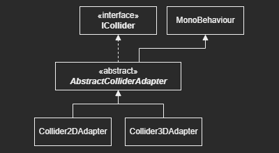
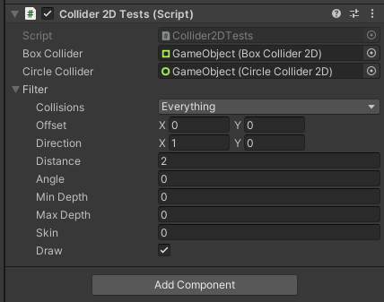
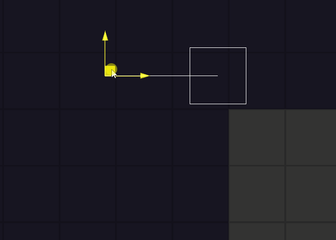
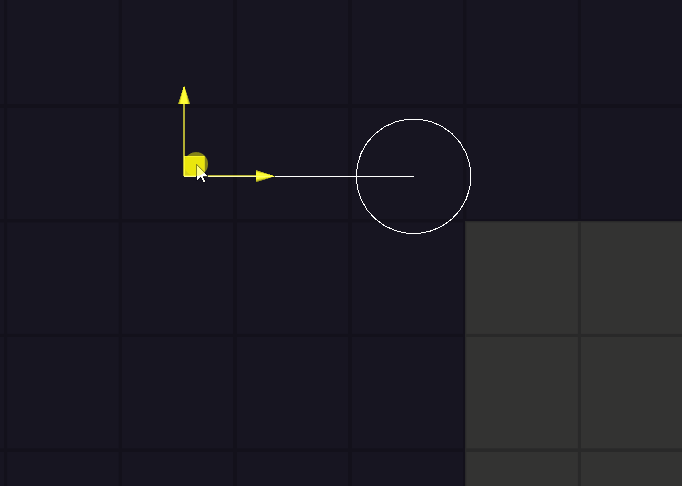

# Collider Adapter

* Abstract adapter classes for 2D and 3D Colliders.
* Unity minimum version: **2019.3**
* Current version: **1.0.0**
* License: **MIT**
* Dependencies: 
    - [com.actioncode.shapes : 1.0.0](https://bitbucket.org/nostgameteam/shapes/src/1.0.0/)

## Summary

Unity does not provides a default script API to use both 2D and 3D colliders at the same time. 

This package tries to fix this by using adapter classes implementing an abstract component, to which implements an ICollider interface:



You can reference and use the AbstractColliderAdapter component to query the collider properties and functions.

Also, this packages contains some extensions.

## How To Use

### Using Collider2D Extensions

Add the namespace ```ActionCode.ColliderAdapter``` into your class and you'll be able to use Cast functions for your Collider2D.

```csharp
using UnityEngine;
using ActionCode.ColliderAdapter;

public class Collider2DTests : MonoBehaviour
{
    public BoxCollider2D boxCollider;
    public CircleCollider2D circleCollider;

    public CastFilter2D filter;

    private void Update()
    {
        boxCollider.Cast(filter, out RaycastHit2D boxHit);
        circleCollider.Cast(filter, out RaycastHit2D circleHit);
    }
}
```

Go to inspector and set the ```Filter``` attribute. 



Now you can move the GameObject and test the cast collision on the Scene:





There are the same extensions for Colliders in 3D.

## Installation

### Using the Package Registry Server

Follow the instructions inside [here](https://cutt.ly/ukvj1c8) and the package **ActionCode-Collider Adapter** 
will be available for you to install using the **Package Manager** windows.

### Using the Git URL

You will need a **Git client** installed on your computer with the Path variable already set. 

Use the **Package Manager** "Add package from git URL..." feature or add manually this line inside `dependencies` attribute: 

```json
"com.actioncode.collider-adapter":"https://bitbucket.org/nostgameteam/collider-adapter.git"
```

---

**Hyago Oliveira**

[BitBucket](https://bitbucket.org/HyagoGow/) -
[LinkedIn](https://www.linkedin.com/in/hyago-oliveira/) -
<hyagogow@gmail.com>